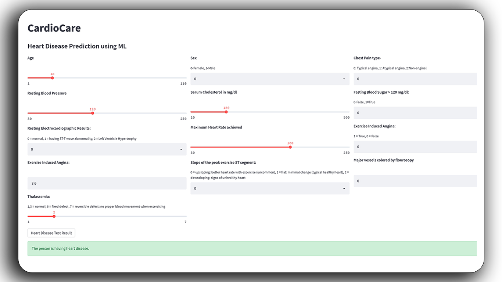

# CardioCare 🫀
### Machine Learning-Based Cardiac Disease Classification Web Application

[](https://cardiocareapp2.streamlit.app/)

CardioCare uses machine learning algorithms to predict heart disease presence, providing healthcare providers and individuals with accurate, accessible cardiac risk assessments through an intuitive web interface.

## 🚀 Features

- **ML-Powered Predictions**: K-Nearest Neighbors, Logistic Regression, and Random Forest algorithms
- **User-Friendly Interface**: Built with Streamlit for easy data input and visualization
- **Real-time Analysis**: Instant cardiac risk assessment
- **Accessible**: Available to healthcare providers and patients

## 🛠️ Technology Stack

- **Python 3.x** with NumPy, Pandas, Scikit-learn
- **Streamlit** for web interface
- **Pickle** for model serialization
- Dataset from [Kaggle](https://www.kaggle.com/datasets/johnsmith88/heart-disease-dataset)

## 📱 Preview




## 🚀 Quick Start

```bash
# Clone repository
git clone https://github.com/luikdb/CardioCareApp.git
cd CardioCareApp

# Install dependencies
pip install -r requirements.txt

# Run application
streamlit run cardiocareapp.py
```

## 🌐 Live Demo

**Web App**: [cardiocareapp2.streamlit.app](https://cardiocareapp2.streamlit.app/)


## 🎯 How It Works

1. **Input**: Patient data (age, blood pressure, cholesterol, etc.)
2. **Processing**: ML algorithms analyze the data
3. **Output**: Heart disease risk prediction with contributing factors

## 🤝 Contributing

1. Fork the repository
2. Create feature branch (`git checkout -b feature/NewFeature`)
3. Commit changes (`git commit -m 'Add NewFeature'`)
4. Push to branch (`git push origin feature/NewFeature`)
5. Open Pull Request
